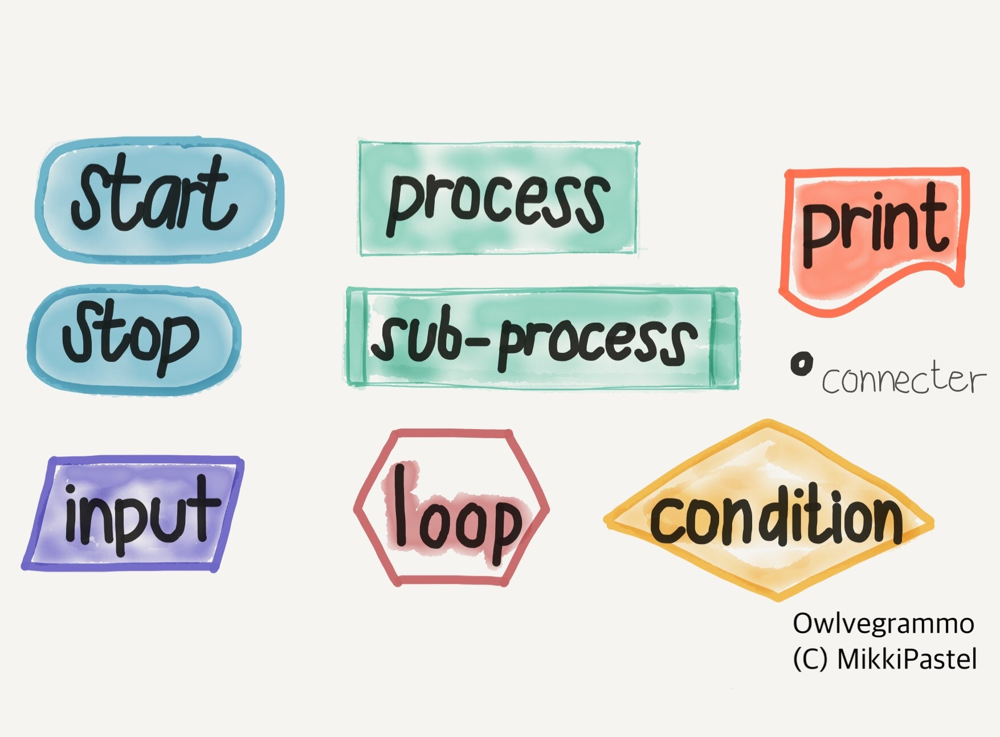
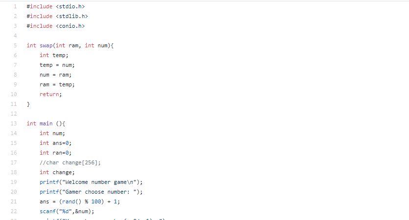
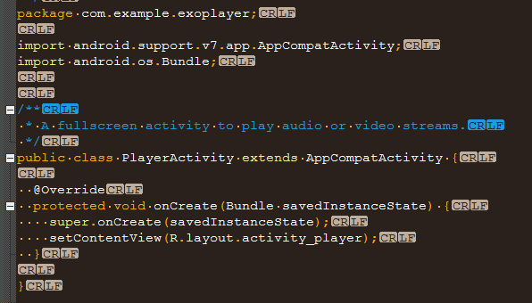

Introduction of Programming
# การทำงานของคอมพิวเตอร์เบื้องต้น

เดิมทีเวลาที่เราป้อนคำสั่งเข้าไปในคอมพิวเตอร์ เครื่องคอมของเราจะแปลงเป็นภาษาเครื่อง(Machine Language)

ซึ่งเป็นเลขฐานสอง ภายหลังมีการพัฒนาภาษาโปรแกรม โดยเริ่มจากภาษาแอสเซมบลี (Assembly Language) เป็นภาษาระดับต่ำ (Low-level Language)

จนพัฒนาภาษาให้ใกล้เคียงกับมนุษย์มากขี้น จนเป็นภาษาโปรแกรมที่เราใช้กัน คือ ภาษาระดับสูง (High-level Language) เช่น C , C++ ,C# , JAVA , PHP , Pascal เป็นต้น

# การแปลภาษาของโปรแกรม

การแปลภาษาของโปรแกรม มี 2 แบบ คือ

**Interpreter** เป็นการแปลคำสั่งทีละบรรทัด เมื่อพบข้อผิดพลาด โปรแกรมจะหยุดทำงานทันที ทำให้โปรแกรมทำงานค่อนข้างช้า เช่น ภาษา python

**Compiler** เป็นการแปลคำสั่งทั้งโปรแกรม ถ้าพบข้อผิดพลาด โปรแกรมจะแสดงข้อผิดพลาดออกมา ทำให้โปรแกรมทำงานได้เร็วกว่า เช่น ภาษา C

# Flowchart

เป็นการวางแผนผังการทำงานของโปรแกรมที่เราเขียน โดยใช้มาตรฐานของ ANSI (American National Standards Institute) เช่น

# Preprocesser directory

ทุกไฟล์ในทุกภาษาจะต้องมีการเรียกใช้ library ต่างๆก่อน จึงจะเข้าสู่การ compile program เช่น

ในภาษา C จะมีการ `#include` เพื่อเรียกใช้ library และ `#define` เพื่อกำหนดค่าที่ใช้ในโปรแกรม

ในภาษา JAVA หรือในภาษา python จะมีการ `import` เพื่อเรียกใช้ library

# Data type

ทุกไฟล์ในทุกภาษาจะต้องมีการเรียกใช้ library ต่างๆก่อน จึงจะเข้าสู่การ compile program เช่น

ในภาษา C จะมีการ `#include` เพื่อเรียกใช้ library และ `#define` เพื่อกำหนดค่าที่ใช้ในโปรแกรม

ในภาษา JAVA หรือในภาษา python จะมีการ `import` เพื่อเรียกใช้ library

# Condition & Loop Statement

การเขียนโปรแกรมหลักๆ

- **Condition** เป็นการเขียนโปรแกรมเพื่อเลือกอย่างใดอย่างหนึ่ง เช่น การเลือกประเภทของสัตว์ ถ้าผู้ใช้เลือกสุนัข โปรแกรมก็จะแสดงผลชื่อสายพันธุ์ของสุนัข เป็นต้น

*syntax* ที่ใช้หลักๆ คือ if-else, switch-case

- **Loop Statement** เป็นการสั่งให้โปรแกรมทำงานคำสั่งเดิมซํ้าๆ ตามจำนวนรอบที่เราต้องการ เช่น การให้หุ่นยนต์วิ่งรอบสนาม

*syntax* ที่ใช้หลักๆ คือ for, while, do-while

เมื่อเราได้เรียนรู้เรื่องการเขียนโปรแกรมภาษคอมพิวเตอร์อย่างคร่าวๆแล้ว เราสามารถเรียนรู้การเขียนภาษาต่างๆ

โดยที่ปุ่มด้านขวาล่าง เพื่อเข้าไปเรียนรู้ภาษาคอมพิวเตอร์กันดีกว่า ^_^