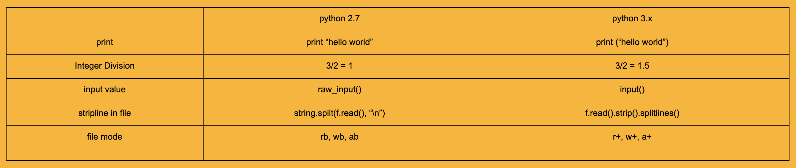
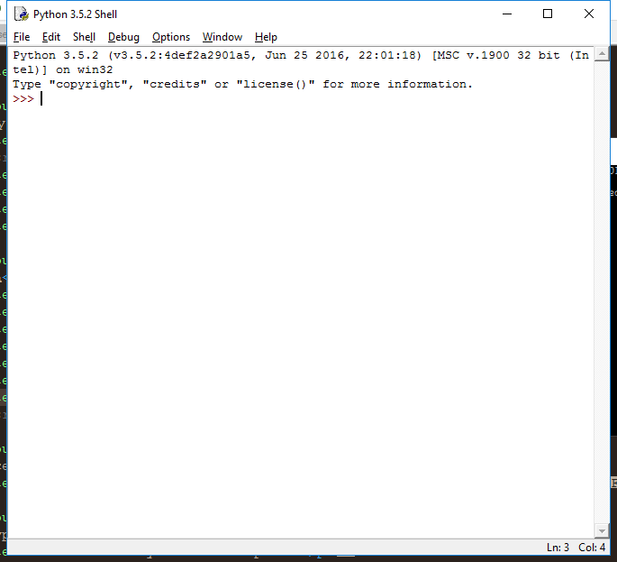

summary: Python of beginner
id: python-of-beginner
categories: Python
tags: Beginner
status: Published 
authors: MikkiPastel

# Python of beginner

<!-- ------------------------ -->

## แนะนำภาษา python

python เวอร์ชั่นปัจจุบัน คือ 3.6 (19 มิถุนายน 2560) เป็น high-level language มีการแปลภาษาแบบ interpreter คือทำทีละบรรทัด เป็นภาษาที่เรียนรู้ได้ง่าย  

ในชีวิตประจำวัน python ถูกนำมาใช้งานหลายอย่าง เช่นการทำ back-end ของ dynamic website, ใช้ในงาน data science, การเขียนโปรแกรมลงบน hardware สำหรับงาน embedded system เป็นต้น  
สามารถดาวน์โหลด python มาใช้งานได้ที่ [https://www.python.org/downloads/](https://www.python.org/downloads/) และมี document วิธีการเขียนโปรแกรมด้วยภาษา python ที่ [https://docs.python.org/3/library/](https://docs.python.org/3/library/)  

เราสามารถใช้ editor ในการเขียนโปรแกรมภาษา python ได้หลากหลายโปรแกรม เช่น notepad++, sublinetext, pyCharm เมื่อเราติดตั้งตัว python แล้ว ก็สามารถ run source code ภาษา python ได้  
  
ความแตกต่างของ python 2.7 vs python 3.3 ถึงเวอร์ชั่นปัจจุบันจะเป็น python 3.x แต่มีบางโปรแกรมและบางหน่วยงานใช้ python 2.7 อยู่ ดังนั้นเราจะมาดูความแตกต่างกันระหว่าง 2 เวอร์ชั่นนี้  
  
    

การเลือกใช้ python ขึ้นอยู่กับโปรแกรมที่รองรับ และปัจจัยอื่นๆ ที่นอกเหนือจากความใหม่ของเวอร์ชั่น 

<!-- ------------------------ -->

## ติดตั้งโปรแกรม python ลงบน computer

[download จากหน้าเว็บ](https://www.python.org/downloads/) เลือก version ได้ตามชอบใจ จากนั้นลงโปรแกรมปกติเลย และส่วนสำคัญ คือ การ set path ที่ system environment  

กดคลิกขวาที่ไอคอนคอมพิวเตอร์ของท่าน เลือก properties และเลือก Advances system setting  

จากนั้นกดปุ่ม Environment Variables ไปที่ system variable เลือกตัวแปรชื่อ path และใส่ path ของ python ลงไปเพิ่ม แค่นี้ก็เรียบร้อย หรือจะทำที่ command line ก็ได้นะ แต่วิธีนี้ชัวร์และอุ่นใจกว่า  

ตัวโปรแกรม python มีสองแบบ คือแบบ command line กับแบบ GUI  
 
    
  
  
ข้อดีข้อเสียอย่างย่อๆ คือ แบบ command line เวลาเราพิมพ์ผิด เราจะต้องพิมพ์ใหม่ ส่วนแบบ GUI เราพิมพ์ผิดแล้วก็อปแก้พิมพ์ใหม่ได้ มีแค่นี้แหละ

<!-- ------------------------ -->

## การพิมพ์คำสั่งขั้นต้น

การพิมพ์ Hello world ออกมาสู่หน้าจอ เวลาเราเรียนภาษาใหม่ๆ มักจะเป็นคำนี้เสมอเลยเนอะ คำสั่งใช้ง่ายมากๆเลย  

```python
print "Hello world" #ง่ายๆเลย แต่อันนี้ของ python 2.7
```

```python
print ("Hello world") #อันนี้ของ python 3.0 ขึ้นไป  
```

นี่คือสิ่งที่เราบอกว่า syntax ต่างกันไงหล่ะ  
  
ใช้ `#` เพื่อ comment code นะจ๊ะ  

ข้อควรระวัง ในภาษา python ไม่ได้ใช้ `;` ในการสิ้นสุดคำสั่งนะ  

และใช้ 2 spaces แทน tab

<!-- ------------------------ -->

## Data type และการประกาศตัวแปร

Data type ใน python ไม่ได้มียุ่บยับหรือภาษาอื่น หลักๆมีสามตัวคือ  
  
#### **Number** : 
ตัวเลขทั้งหลาย เราจะบวกลบคูณหารผ่าน python ก็ทำได้ง่าย สบายๆเลย เช่น  
    
บวก ลบ คูณ หาร : +, -, *, /         =>       7/2  
การหารเอาเศษ  : mod %              =>       7/2  
เลขยกกำลัง     : power **           =>       7**2  
การหารแบบปัดลง : floor division //  =>       7//2  
การหารแบบปัดขึ้น : round()            =>       round(7/2)  
  
**ตัวอย่าง**  
2^n - 1 จะได้เป็น `(2**n)-1`
pi r^2  จะได้เป็น `pi*(r**2)`
  
ตัวแปรประเภท Number ประกาศ data type เป็น เลขจำนวนเต็ม `int()` และ จำนวนทศนิยม `float()`
หรือประกาศเป็นเลขฐานต่างๆก็ได้ด้วยนะ เช่น เลขฐานสอง `bin()` เลขฐานสิบหก `hex()` เช่น  

```python
int(‘11001100’,2) #204 แปลงเลขฐานสองเป็นฐานสิบ  
int(‘0x20’,16) #32แปลงเลขฐานสิบหกเป็นฐานสิบ

bin(int(‘0xDEC’,16)) #แปลงเลขฐานสิบหกเป็นฐานสิบ และแปลงเป็นเลขฐานสอง

hex(int(‘101010101010’,2)) #0xAAA แปลงเลขฐานสองเป็นฐานสิบ และแปลงเป็นเลขฐานสิบหก
```

__การทำ Fixed point number__

```python
from decimal import Decimal  
interest = Decimal(“6.4200”)  
```
  
#### **String** : 
ตัวอักษร พี่เหลือมสามารถเล่นได้เยอะแยะเลย ทั้งการเลือกตัวอักษร ตัดทิ้ง บวกสตริง เซ็คความยาว  
    
การสร้างตัวแปร string ใหม่ : `hello = str()`
  
การตรวจสอบความยาวของ string : `len(hello)`
ถ้าความยาวเป็น 0 นั่นคือเป็นตัวแปร string เปล่าๆ นั่นเอง  
  
ค้นหาคำที่เราต้องการในตัวแปร string : `find()`
  
**การตัดคำ**
การนำ space หัวท้ายออกจากกัน : `strip()`
การตัดคำออกตามที่เราต้องการ : `split()`
การแทนค่าคำ : `replace()`
  
__ช่วงลองทำดู__ เนื่องจากมันเล่นได้หนุกหนาน เลยมีอะไรให้ลองทำนิดหน่อย  
1. ให้ตัวแปร string ชื่อว่า hello แล้วกัน มีค่า Hello, it's me. I was wondering if after all these years  
2. ตรวจสอบความยาวของ hello  
3. หาคำว่า me ใน hello  
4. ตัดคำจาก space ออกเป็นคำๆ  
5. แทนค่าคำว่า me ว่า you  
  
__คำเฉลย__

```python 
hello = "Hello, it's me. I was wondering if after all these years"  
len(hello)  
hello.find("me")  
hello.split(" ")  
hello.replace("me","you")  
```
  
เราสามารถใช้ escaped with backslashes `(\\n \\r \\n \\t \\0 \\x)` ใน python ได้ด้วยนะ  
  
#### **List** : 
อันนี้อาจจะต่างจากพวกภาษา C แต่ภาษาอื่นๆก็มี มันคล้ายๆ array แต่ไม่ใช่ซะทีเดียว  
 
```python  
list = [1, 2, ,3, ...]  
```
  
การใส่ค่าใน list ไม่จำเป็นต้องใส่ค่าประเภทเดียวกัน เช่น  
```python  
member = [“brown”, 94, True]  
```
  
การเพิ่มสมาชิกใหม่ มี 2 แบบ คือ  
- **append** : ใส่เป็นคำ หรือตัวเลขก็ได้ => `list.append()`
- **extend**  : ใส่เป็น string character => `list.extend(\[\])`
  
การลบสมาชิกออก ใช้ `list.remove()` ข้างในใส่สมาชิกตัวที่เราต้องการจะลบ  
ถ้าล้างไส้ในทั้งหมด ใช้ `list.clear()`  
  
การตรวจสอบความยาวของ list ใช้คำสั่ง `len(list)`  
  
__ตัวอย่างการใช้งาน__
```python 
fav_stock = ["ADVANC", "BEM", "CPALL", "CPF", "AU"]  
```
1. เพิ่ม "BAY"  
2. ลบ "AU"  
3. เปลี่ยน "ADVANC" เป็น "INTOUCH"  
4. หาจำนวนชื่อหุ้นใน fav_stock  

__คำเฉลย__

```python 
fav_stock.append("BAY")
fav_stock.remove("AU")
fav_stock[0] = "INTOUCH"
len(fav_stock)
```
 
#### **Boolean** :
อันนี้เหมือนภาษาอื่นๆ มีค่าสองแบบเท่านั้น คือ `True` กับ `False`  

สรุป python ไม่ต้องประกาศตัวแปรให้วุ่นวาย เช่น uint8 i = 0; งี้ แค่ใส่ค่าไปเลย เช่น `i = 0` จบ

<!-- ------------------------ -->

## comparison

การเปรียบเทียบค่าในภาษา python แบ่งเป็น 4 แบบ ดังนี้

- **logical** : and, or, not, and not เช่น `(len(list) >= 0) and (boo != False)`
- **identity** : is, is not, not เช่น `not (boo)`
- **arithmetic** : >, >=, <, <=, ==, != เช่น `len(list) >= 0`, `boo != False` 
- **Null** : None เช่น `list != None`  
    
ซึ่งเรื่องนี้นำไปใช้ใน condition statement

<!-- ------------------------ -->

## condition statement

ใน python มี `if-else` ในการเลือกการตัดสินใจ มี syntax ดังนี้  

- **แบบทางเดียว**

```    
if (consition):  
    <statement>  
```

- **แบบสองทาง**

```
if (consition):  
    <statement>  
else:  
    <statement>  
```

- **แบบหลายทาง**

```
if (condition):  
    <statement>  
elif (condition):  
   <statement>  
else:  
    <statement>  
```

มาลองทำดูดีกว่า  

เขียนโปรแกรมตัดเกรดกันเถอะ ...  
การตัดเกรดของวิชาการเรียน python พื้นฐาน มีเกณฑ์ ดังนี้  
100 = A+, >=80 = A, >=70 = B, >=60 = C, >=50 = D, other = F  

มาลงโค้ดดิ้งกัน  
ให้ input มีชื่อตัวแปรว่า score และ output ชื่อว่า grade  

```python  
# input student score  
score = 78  
  
if (score == 100):  
  grade = "A+"  
elif ((score >= 80) and (score < 100)):  
  grade = "A"  
elif ((score >= 70) and (score < 80)):  
  grade = "B"  
elif ((score >= 60) and (score < 70)):  
  grade = "C"  
elif ((score >= 50) and (score < 60)):  
  grade = "D"  
else:  
  grade = "F"  
  
print (grade)
```

<!-- ------------------------ -->

## loop statement

ใน python มี for และ while ในการใช้วนลูป  

มาลองทำดูดีกว่า พิมพ์ค่าสมาชิกแต่ละตัวใน array_list  
ซึ่งในภาษา python จะต่างจากภาษาอื่นๆ สามารถวนลูปค่าใน list ได้เลย ภาษาอื่นๆจะวนจากตัวเลข เช่น  

```python
array_list = [‘apple’, ‘papaya’, ’banana’, ’orange’]  
for i in array_list:  
   print (i)  
```

ให้พิมพ์เลข 1-10 ออกมาสู่หน้าจอ สามารถเขียนได้ดังนี้  

```python
# print 1-10
i=1  
while i <= 10:  
    print(i)  
    i += 1  
```
  
function range เป็น function ที่สร้าง range ค่าในช่วงที่เราต้องการ  
เช่น `range(10)` สร้างค่าเริ่มจาก 0 ไป 10 ตัว ดังนั้นจะได้ค่า 0-9 เราไม่สามารถเขียนเป็นเลขโดดๆใน for ได้  

```python
# print 1-10
for i in range(1, 11):  
   print (i)  
```
  
**loop comprehensions** คือการเขียน loop statement แบบลดรูป พร้อมการเปรียบเทียบค่า  
ตัวอย่าง เช่น หาเลขระหว่าง 0-30 ที่หารด้วย 2 ลงตัว  
  
ถ้าเราจะเขียนแบบเต็มๆ จะได้แบบนี้ ข้อดี คือ สามารถตรวจสอบได้เวลาที่โค้ดเรามีปัญหา  

```python
evens = []  
for i in range(31):  
   if i % 2 == 0:  
      evens.append(i)  
```
  
และการเขียนแบบลดรูปแบบ **loop comprehensions**

```python
evens = [i for i in range(31) if i % 2 == 0]
```
<!-- ------------------------ -->

## การใช้ break, continue และ pass ใน statement

- **break** คือ การให้โค้ดของเราหยุดทำงาน เมื่อเข้าสู่ statement ที่เรากำหนด  
- **continue** คือหลังจากเจอ statement ที่เรากำหนด ก็ให้ตรวจที่ statement ถัดไป  
- **pass** ใส่เมื่อเราไม่ให้มีการทำงานใดๆเมื่อเข้า statement ที่เรากำหนด  

__ตัวอย่าง__

```python
# check order  
if (order == 0):  
  break  
elsif (order == 1):  
  continue  
elif (order % 3 == 0):  
  pass  
else:  
  print (order)
```

<!-- ------------------------ -->

## Function
มี syntax การเขียนดังนี้  

```python
def fn_name(input):  
   …  
   return output  
```
  
เรามีวิธีง่ายๆ นั่นคือ การนำโปรแกรมตัดเกรดของเรามาใส่ในฟังก์ชั่น โดยมี input คือ คะแนนของนักเรียนในวิชาการเรียน python พื้นฐาน และ คืนค่าเป็นเกรดของนักเรียน  

```python  
def python_grade(score)  
  # ใส่โปรแกรมตัดเกรดของเราลงไป  
  if (score == 100):  
    grade = "A+"  
  elif ((score >= 80) and (score < 100)):  
    grade = "A"  
  elif ((score >= 70) and (score < 80)):  
    grade = "B"  
  elif ((score >= 60) and (score < 70)):  
    grade = "C"  
  elif ((score >= 50) and (score < 60)):  
    grade = "D"  
  else:  
    grade = "F"  
  return grade  
``` 

การเรียกใช้งาน เป็นดังนี้  

```python 
python_grade(78)  
```

ถ้าต้องการแสดงผล สามารถใส่ print ครอบไว้ได้ 

```python  
print(python_grade(78))
```

<!-- ------------------------ -->

## Data structure

#### **tuple** 
เราสามารถเก็บข้อมูล data type ใดก็ได้ ในตัวแปร tuple

```python
t = 12345, 54321, 'hello!'
```

การ update ค่าใน tuple : `t[0] = 0`
เราสามารถนำ tuple นำมาบวกกันได้ด้วยนะ : `t3 = t1 + t2`
การลบค่าทั้งหมดใน tuple : `del t`

#### **set**  
**union** หาสมาชิกทั้งหมดที่อยู่ใน a และ b ->set(a) | set(b)
**intersection** หาสมาชิกที่เหมือนกันใน a และ b -> set(a) & set(b)
**complement** หาสมาชิกที่อยู่ใน a แต่ไม่อยู่ใน b -> set(a) - set(b)
**subset** หาสมาชิกจาก a ที่อยู่ใน b -> set(a).issubset(set(b))

#### **dictionary**
    
```python
num = {‘one’: 1, ‘two’: 2, ‘three’: 3}  
```

หาขนาดของ dict : `len(num)`
หา key ของ dict : `num.keys()`
หา value ของ key : `num.values()`
การเพิ่มสมาชิกหรือ update value ของ dict : `num[‘four’] = 4`
การเคลียร์ค่าใน dict : `num.clear()`

การแสดงผลค่า key และ value ของสมาชิกแต่ละตัวใน dict  

```python
for key, val in num.items():  
 print (key, val)  
```
  
การเรียงค่า key ของ dict โดย output จะเป็น list : `sorted(num)`
การเรียงค่า key และ value ของ dict โดย output จะเป็น list เช่นกัน: `sorted(num.value)`

for sort by key and show all member in dict, output is tuples data type

```python
sorted(num.items(), key=lambda x:x[1])
```

<!-- ------------------------ -->

## การทำงานร่วมกันกับไฟล์

การอ่านไฟล์ มี syntax หลักๆ ดังนี้  

```python
f = open(filename, mode)  
```

parameter ตัวแรก คือ ชื่อไฟล์ และตัวที่สอง คือโหมดการอ่านเขียนไฟล์  
  
โหมดการเขียนอ่านไฟล์ มีดังนี้  
`r` : read อ่าน  
`w` : overwrite เขียนทับ  
`a` : write at end of the file เขียนต่อ  
**mode++** : reading & writing => r+, w+ a+  

มาดูการเขียนโค้ดกันดีกว่า

```python
# open file  
f = open(‘text.txt’, ‘a’)  
  
# read file   
code = f.read()  
```
  
หลังจากอ่านไฟล์แล้ว สามารถส่วนนี้ไปใช้งานได้ แต่ประเภทของตัวแปรจะเป็นแบบ binary  

ดังนั้นอาจจะต้องแปลงเป็น string โดยใช้ `decode("utf-8")` เช่น

```python  
# find word in line of file  
if (code.find(b"file") >= 0):  
  print (code)  
  
elif (code.decode("utf-8").find(b"line") >= 0):  
  print (code)  
  
# spilt line  
lines = code.strip().splitlines()  
  
# read single line of a file  
f.readline()  
  
# write file  
f.write(“blah blah blah”)  
  
#close file  
f.close()
```

<!-- ------------------------ -->

## Exception handling

**syntax error** คือ การที่ compiler แจ้งในส่วนที่เราเขียนโค้ดผิด syntax ที่เราพบเห็นกัน มีดังนี้  

- `SyntaxError : invalid syntax`
- `IndexError: string index out of range`  
- `NameError: name 'n' is not defined`  
      
**exception** คือ การที่ compiler แจ้งเราว่า code error ไม่สามารถทำงานต่อได้ มี Error defect ดังนี้  

- `ZeroDivisionError: division by zero`  
- `NameError: name 'test2' is not defined`  
- `TypeError: unsupported operand type(s) for -: 'str' and 'int'`
      
**handling exception** การจัดการเมื่อโค้ดของเรามีปัญหา มี syntax การเขียน ดังนี้  

```python
try:  
   # Protected code  
except:  
   # Catch block  
else:  
   # The finally block always executes.  
```

การทำงาน ทำในส่วนของ try ก่อน ถ้าทำงานในส่วนนี้สำเร็จ ก็คือจบ ถ้าไม่สำเร็จ จะไปในส่วนของ except ต่อ:  
  
**raising Exceptions** ถ้าเปรียบเทียบกับ JAVA เหมือน throw  

```python
ValueError('A very specific bad thing happened')  
 ```

ตัวอย่างการใช้งาน เช่น การหารด้วยศูนย์  

```python
try:  
   result = input1 / input2  
except ZeroDivisionError:  
   print (“cannot divide by 0”)
```